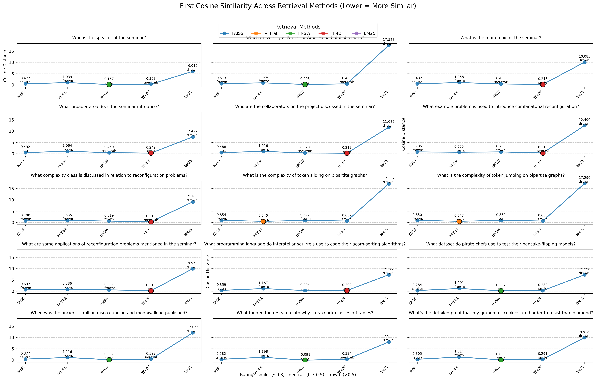

## Introduction

This repository contains the final assignment for the CMPS 396AH course. The project involves building a Retrieval-Augmented Generation (RAG) system for the YouTube video: [youtube video](https://www.youtube.com/watch?v=dARr3lGKwk8).

The model implements five retrieval methods and is evaluated using a golden test set comprising 10 answerable queries and 5 unanswerable queries. The implementation is written in Python, and a Streamlit interface is provided to visualize the workflow.


## Retrieval Techniques

### Semantic Retrieval

- **FAISS**:
  - FAISS: performs fast similarity search by indexing dense vectors in optimized data structures, enabling rapid retrieval of semantically similar video segments based on query embeddings.

- **PostgreSQL with pgvector**:
  - **IVF-FLAT Index**:
    - The IVF-FLAT index in pgvector partitions vectors into clusters, searching only the nearest clusters to efficiently retrieve similar vectors from a PostgreSQL database.
  - **HNSW Index**:
    - uses hierarchical navigable small world graphs to enable high-accuracy, low-latency similarity search by navigating through layered graph structures in pgvector.

### Lexical Retrieval

- **TF-IDF**:
  - Ranks video segments based on term frequency and rarity.

- **BM25**:
  - Advanced ranking with term saturation and length normalization.

### Running the Files

To execute the VideoRAG pipeline and visualize results, follow these steps:

1. **Install Dependencies**:
   Install the required Python libraries and run the setup script:
   ```bash
   pip install -r requirements.txt
   bash dependencies.sh
2. Add Files to Data Directory: Place the required audio and video files in the data directory, following the instructions in hi.txt.
3. Navigate to the Source Directory: Change to the src directory, which contains the main scripts:
   ```bash
   cd src
4. Run the Main Script: Execute the main.py RAG pipeline
5. Generate Plots: Run the final.py script to create visualization plots

### Race 


### Streamlit interface
1. **Navigate to the Directory**:
   Ensure you are in the root directory of the repository (where `app.py` is located). If not, navigate there:
   ```bash
   cd src/app.py

  2. run inside the terminal
  ```bash
  streamlit run app.py

